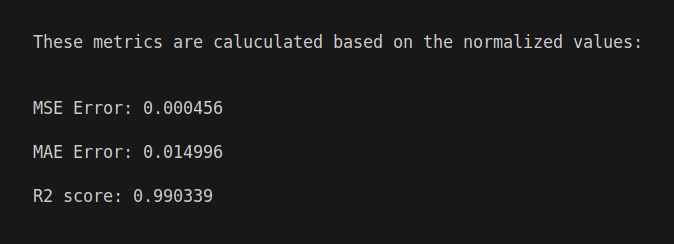
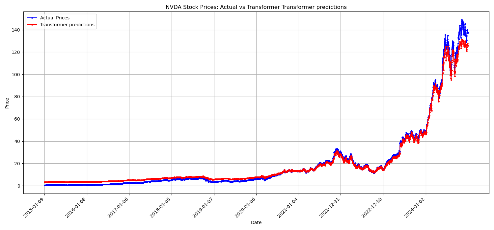

# Transformer Model from Scratch Optimized by Genetic Algorithms for Stock Market Prediction


## 📌 Project Overview

This project implements a **Transformer model from scratch**, meaning it does not rely on the PyTorch API for Transformers. Instead, it is entirely custom-built and designed for time series prediction, specifically for forecasting stock market prices.

Additionally, this project includes an enhanced version of the Transformer, `Transformer_GA.py`, which integrates **Genetic Algorithms (GA)** to optimize hyperparameters dynamically.

## 📂 Project Structure

The repository contains the following key components:

- **`Transformer_GA.py`** → Implements the Transformer model with Genetic Algorithms for hyperparameter tuning.
- **`Transformer_s_time_series_1.py`** → Standard Transformer model for time series prediction.
- **`datasets/`** → Contains the stock market data used for training and evaluation.
- **`best_model_weights/`** → Stores the best-trained model weights.
- **`plots.py`** → Generates visualizations of model predictions vs. ground truth (GT).
- **`stats/`** → Stores evaluation metrics and statistics.
- **`assets/`** → Contains images used in the README.

---

## 🚀 **Performance on NVIDIA Stock Prediction**

Our trained Transformer model successfully predicts NVIDIA stock prices with remarkable accuracy. The evaluation metrics achieved are:

📊 **Performance Metrics**


---

## 📈 **Ground Truth vs. Predictions**
The following plot visualizes the model’s predictions against the actual stock prices:



As shown, the model effectively captures the stock market trend with minimal deviation from real values.

---

## 📥 **Cloning the Repository**
To use this project, clone the repository and navigate into it:

```bash
git clone https://github.com/YourGitHubUsername/Transformer-Stock-Prediction-GA.git
cd Transformer-Stock-Prediction-GA


