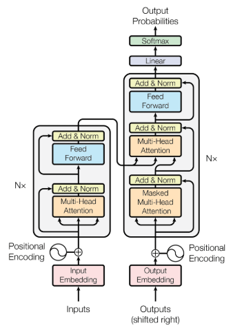

# Transformer Model from Scratch Optimized by Genetic Algorithms for Stock Market Prediction



## 📌 Project Overview

This project implements a **Transformer model from scratch**, meaning it does not rely on the PyTorch API for Transformers. Instead, it is entirely custom-built and designed for time series prediction, specifically for forecasting stock market prices.

Additionally, this project includes an enhanced version of the Transformer, `Transformer_GA.py`, which integrates **Genetic Algorithms (GA)** to optimize hyperparameters dynamically.

## 📂 Project Structure

The repository contains the following key components:

- **`Transformer_GA.py`** → Implements the Transformer model with Genetic Algorithms for hyperparameter tuning.
- **`Transformer_s_time_series_1.py`** → Standard Transformer model for time series prediction.
- **`datasets/`** → Contains the stock market data used for training and evaluation.
- **`best_model_weights/`** → Stores the best-trained model weights.
- **`plots.py`** → Generates visualizations of model predictions vs. ground truth (GT).
- **`stats/`** → Stores evaluation metrics and statistics.
- **`assets/`** → Contains images used in the README.

---

## ⚠️ **Important Notice: Training Required**
The trained model weights have been **removed** due to file size limitations. If you want to test the model, you must first **retrain it**.
(🚨 Create transformer and transformer_GA folders inside ---> best_model_weights before training 🚨)

There are **two ways to train the model**:

1️⃣ **Standard Transformer Training** 
- Run `Transformer_s_time_series_1.py` to train the model. 
- Before running, set the `--train` flag to `True` inside `args.py`. 
- If `--train` is set to `False`, the script will attempt to test the model, but it will fail due to missing trained weights.

2️⃣ **Optimized Training with Genetic Algorithms (GA)** 
- Run `Transformer_GA.py` for a more **robust training process** using **Genetic Algorithms** to find the best hyperparameters. 
- Simply execute the script or run it from the terminal.

🚨 **Using Custom Datasets:** 
If you want to train the model on a different dataset: 
- You need to download a new dataset from **Yahoo Finance**. 
- The `preprocessing.py` script provides tools for downloading and preprocessing stock data for time series. 
- However, **preprocessing time series data requires advanced knowledge**. The script includes complex arguments that may not be intuitive for beginners in data processing.

---

## 📥 **Cloning the Repository**
To use this project, clone the repository and navigate into it:

```bash
git clone https://github.com/YourGitHubUsername/Transformer-Stock-Prediction-GA.git
cd Transformer-Stock-Prediction-GA


